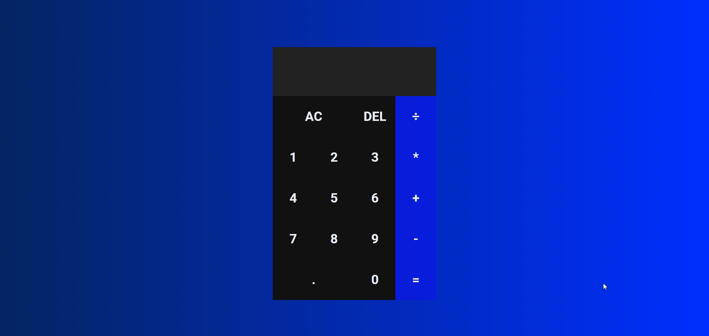

# Calculadora

Projeto para treinar as habilidades em HTML, CSS e JavaScript

 

<h1>Projeto Original</h1>

<a href="https://www.youtube.com/watch?v=93wPYo1pjic" target="_blank">https://www.youtube.com/watch?v=93wPYo1pjic</a>

<h1>Tecnologias</h1>

<ul>
    <li>HTML</li>
    <li>CSS</li>
    <li>JavaScript</li>
</ul>

<h1>Sites</h1>

Sites que ajudaram no desenvolvimento dessa aplicação.

<ul>
    <li><a href="https://fontawesome.com/" target="_blank">Ícones</a></li>
    <li><a href="https://fonts.google.com/" target="_blank">Fonte</a></li>
</ul>
